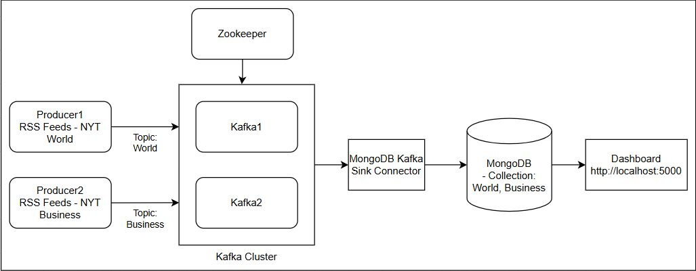
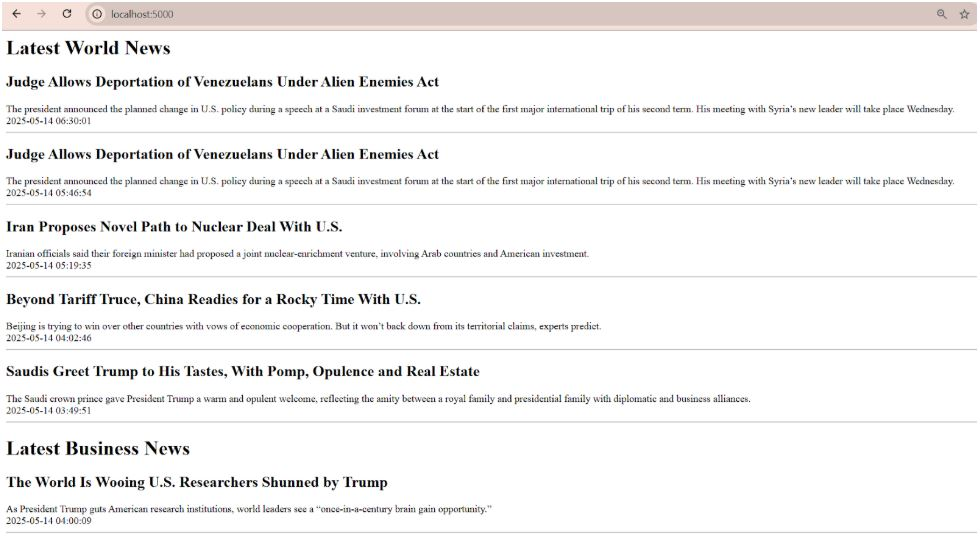

# Real-time Processing News Headline Text

This project builds a real-time pipeline that streams RSS feeds from The New York Times (NYT) into Kafka, stores the data in MongoDB, and displays the latest headline news in a Flask dashboard. 

#### Data Architecture



#### Components
- Producers:  Fetch RSS feeds from the New York Times and publish to Kafka topics
- Kafka Cluster: 2 Kafka brokers to ensure high availability
- Zookeeper: Manages the Kafka cluster and consumer client details
- MongoDB Kafka Sink Connector: Subscribe to the Kafka topics and writes the messages to MongoDB
- MongoDB: Stores the article data from RSS feeds
- Flask Dashboard: Displays the latest articles headlines from MongoDB

#### Running the Project
```
docker-compose up -d --build 
``` 
Go to http://localhost:5000 to view the latest news headlines




#### References
- https://github.com/mongodb-university/kafka-edu/tree/main/docs-examples/mongodb-kafka-base
- https://dev.to/boyu1997/intro-to-kafka-4hn2
